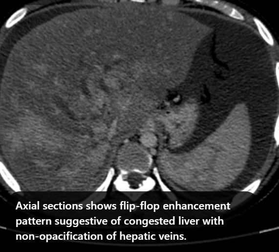
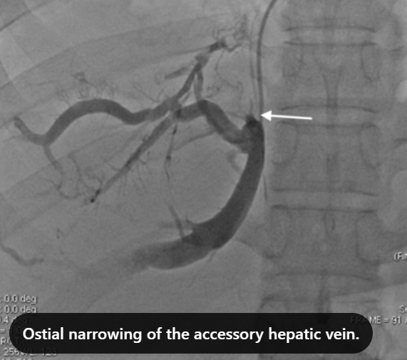
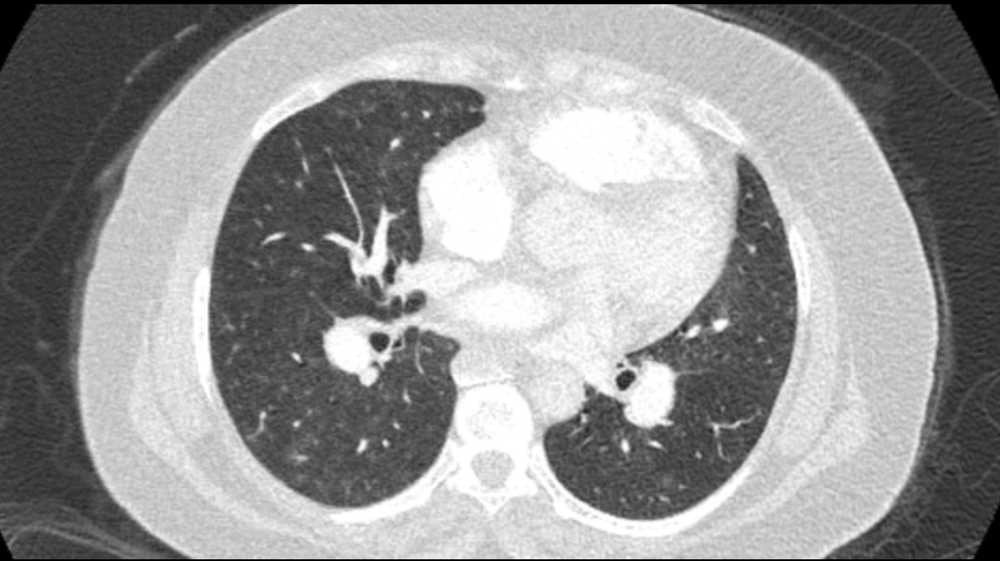
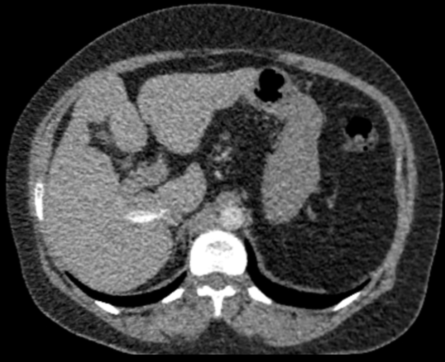

## Installation

### GPU Version
```text
bash docker.sh
```

## Code
```
├── code
│   ├── cambrian # cambrian package (only for train under gpu)
│   │   ├── model # model structure code folder
│   │   ├── train # train code folder
│   │   │   ├── cambrian_trainer.py # cambrian's trainer function
│   │   │   ├── train_fsdp.py # cambrian's train function by using gpu
│   │   │   ├── train_mem.py
│   │   │   ├── train_tpu.py # cambrian's train function by using tpu
│   │   │   ├── train_xformers.py
│   │   │   └── wandb_nan_alert_callback.py
│   │   └── utils.py
│   ├── filter.py
│   ├── fsdp_config.json
│   ├── inference # cambrian's inference code
│   │   ├── cambrian # cambrian inference code (only for inference)
│   │   ├── scripts
│   │   │   ├── inference.sh # cambrian's inference code
│   ├── pre
│   │   ├── deal_LLD_instruct.py # Generate QA pair for LLD datasets
│   │   ├── deal_MAMA-MIA.py # Generate QA pair for MAMA-MIA datasets
│   │   ├── deal_euro.py # Generate QA pair for EURO datasets
│   │   ├── deal_eurorad.sh # Parralize generation
│   │   ├── deal_pmc.py # Classify PMC data and extract the medical domain data sets
│   │   ├── deal_pmc_oa.py # Extract the medical domain data sets
│   │   ├── deal_quilt.py # Generate QA pair for Quilt datasets
│   │   ├── deeplesion_instruct.py # Generate QA pair and caption for Deeplesion datasets
│   │   ├── eurorad.json
│   │   ├── deal.sh # Extract the image and caption from original PMC Data
│   │   ├── deal2.py # Extract the image and caption from original PMC Data
│   │   ├── untar_pmc.py # Unzip the pmc data
│   │   ├── pmc_instruct.py # Generate the instruction tunning data for pmc data
│   │   ├── combine_pmc.py # Find the caption and corresponding image path
│   │   ├── gpt4_pre.sh # Parralize deal_pmc.py
│   │   ├── pmc_instruct.py # Generate QA pair for PMC datasets
│   │   ├── pre_LLD.py # Extract LLD datasets
│   │   ├── pre_MAMA-MIA.py # Extract MAMA-MIA datasets
│   │   ├── pre_PadChest.py # Genrate caption for PadChest datasets
│   │   ├── rad_instruct.py # Genrate caption for radiopaedia datasets
│   │   └── sample_pmc.py
│   ├── scripts
│   │   ├── cambrian
│   │   │   ├── finetune_cambrian_8b.sh # fintune script
│   │   │   ├── pretrain_cambrian_8b.sh # pretrain script
│   │   │   └── transfer.sh # transfer weight
│   │   ├── zero2.json # Deepspeed config file
│   │   ├── zero3.json # Deepspeed config file
│   │   └── zero3_offload.json # Deepspeed config file
│   └── transfer.py # Convert cambrian weight to huggingface weight
└── docker.sh
```


## Train

Below is the latest training configuration for PMC-Cambrian.

### Hyperparameters

Both hyperparameters used in pretraining and finetuning are provided below.(In cambrian paper the global batch size should be 512 but there we don't have enough GPU and TPU, hence the global batch size should be around 8 for per GPU during the pretrain stage, and the gradient_accumulation_steps should be around 4)

#### 1. Visual Connector Training

| Base LLM          | Global Batch Size | Learning rate | SVA Learning Rate | Epochs | Max length |
|-------------------|-------------------:|--------------:|------------------:|-------:|-----------:|
| LLaMA-3 8B        | NaN                | 1e-3          | 1e-4              | 1      | 2048       |
| Vicuna-1.5 13B    | NaN                | 1e-3          | 1e-4              | 1      | 2048       |
| Hermes Yi-34B     | NaN               | 1e-3          | 1e-4              | 1      | 2048       |

#### 2. Instruction Tuning

| Base LLM          | Global Batch Size | Learning rate | Epochs | Max length |
|-------------------|-------------------:|--------------:|-------:|-----------:|
| LLaMA-3 8B        | NaN                | 4e-5          | 1      | 2048       |
| Vicuna-1.5 13B    | NaN                | 4e-5          | 1      | 2048       |
| Hermes Yi-34B     | NaN               | 2e-5          | 1      | 2048       |

For instruction finetuning, we conducted experiments to determine the optimal learning rate for our model training. Based on our findings, we recommend using the following formula to adjust your learning rate based on the availability of your device:

```text
optimal lr = base_lr * sqrt(bs / base_bs)
```


### Training Spatial Vision Aggregator (SVA)

We provide sample training scripts in:

- [scripts/cambrian/pretrain_cambrian_8b.sh](code/scripts/cambrian/pretrain_cambrian_8b.sh)


### Instruction Tuning

We provide sample training scripts in:

- [scripts/cambrian/finetune_cambrian_8b.sh](code/scripts/cambrian/finetune_cambrian_8b.sh)


### Options to note:

- `--mm_projector_type`: To use our SVA module, set this value to `sva`. To use the LLaVA style 2-layer MLP projector, set this value to `mlp2x_gelu`.
- `--vision_tower_aux_list`: The list of vision models to use (e.g. `'["siglip/CLIP-ViT-SO400M-14-384", "openai/clip-vit-large-patch14-336", "facebook/dinov2-giant-res378", "clip-convnext-XXL-multi-stage"]'`).
- `--vision_tower_aux_token_len_list`: The list of number of vision tokens for each vision tower; each number should be a square number (e.g. `'[576, 576, 576, 9216]'`). The feature map of each vision tower will be interpolated to meet this requirement.
- `--image_token_len`: The final number of vision tokens that will be provided to LLM; the number should be a square number (e.g. `576`). Note that if the `mm_projector_type` is mlp, each number in  `vision_tower_aux_token_len_list` must be the same as `image_token_len`.
The arguments below are only meaningful for SVA projector
- `--num_query_group`: The `G` value for SVA module.
- `--query_num_list`: A list of query numbers for each group of query in SVA (e.g. `'[576]'`). The length of the list should equal to `num_query_group`.
- `--connector_depth`: The `D` value for SVA module.
- `--vision_hidden_size`: The hidden size for SVA module.
- `--connector_only`: If true, the SVA module will only appear before the LLM, otherwise it will be inserted multiple times inside the LLM. The following three arguments are only meaningful when this is set to `False`.
- `--num_of_vision_sampler_layers`: The total number of SVA modules inserted inside the LLM.
- `--start_of_vision_sampler_layers`: The LLM layer index after which the insertion of SVA begins.
- `--stride_of_vision_sampler_layers`: The stride of the SVA module insertion inside the LLM.

## Evaluation
We will release this part of code very soon.

## Demo
The following instructions will guide you through launching a local Gradio demo with Cambrian. We provide a simple web interface for you to interact with the model. You can also use the CLI for inference. This setup is heavily inspired by [LLaVA](https://github.com/haotian-liu/LLaVA).


#### 1. Launch a controller
```Shell
python -m cambrian.serve.controller --host 0.0.0.0 --port 10000
```

#### 2. Launch a gradio web server.
```Shell
python -m cambrian.serve.gradio_web_server --controller http://localhost:10000 --model-list-mode reload
```
You just launched the Gradio web interface. Now, you can open the web interface with the URL printed on the screen. You may notice that there is no model in the model list. Do not worry, as we have not launched any model worker yet. It will be automatically updated when you launch a model worker.


#### Launch a model worker

This is the actual *worker* that performs the inference on the GPU.  Each worker is responsible for a single model specified in `--model-path`.

```Shell
python -m cambrian.serve.model_worker --host 0.0.0.0 --controller http://localhost:10000 --port 40000 --worker http://localhost:40000 --model-path nyu-visionx/cambrian-8b
```
Wait until the process finishes loading the model and you see "Uvicorn running on ...".  Now, refresh your Gradio web UI, and you will see the model you just launched in the model list.

You can launch as many workers as you want, and compare between different model checkpoints in the same Gradio interface. Please keep the `--controller` the same, and modify the `--port` and `--worker` to a different port number for each worker.
```Shell
python -m cambrian.serve.model_worker --host 0.0.0.0 --controller http://localhost:10000 --port <different from 40000, say 40001> --worker http://localhost:<change accordingly, i.e. 40001> --model-path <ckpt2>
```

If you are using an Apple device with an M1 or M2 chip, you can specify the mps device by using the `--device` flag: `--device mps`.

#### Launch a model worker (Multiple GPUs, when GPU VRAM <= 24GB)

If the VRAM of your GPU is less than 24GB (e.g., RTX 3090, RTX 4090, etc.), you may try running it with multiple GPUs. Our latest code base will automatically try to use multiple GPUs if you have more than one GPU. You can specify which GPUs to use with `CUDA_VISIBLE_DEVICES`. Below is an example of running with the first two GPUs.

```Shell
CUDA_VISIBLE_DEVICES=0,1 python -m cambrian.serve.model_worker --host 0.0.0.0 --controller http://localhost:10000 --port 40000 --worker http://localhost:40000 --model-path nyu-visionx/cambrian-8b
```

### Prompt Template

### Generate Instruction Data Prompt Example Template

| Section | Content |
|---|---|
| **System Prompt** | Analyze the provided MRI image and generate a detailed and professional medical report that describes only the abnormalities, significant features, or relevant observations directly seen in the image. Use precise medical terminology and maintain a formal tone. Do not include any introductory phrases such as *"The provided image reveals"* or any concluding remarks. Here are some relevant medical guidelines and clinical cases for you to generate. |
| **Medical Guideline** | Angioplasty (PTBA) of the hepatic vein is a safe and effective treatment for Budd–Chiari syndrome (BCS) caused by hepatic venous outflow obstruction. This study, conducted between September 1996 and October 2008, included 101 patients (52 males, 49 females) with a mean age of 31.3 years, all presenting with symptomatic portal hypertension. Of these, 92 patients underwent successful PTBA, targeting the right, left, or accessory hepatic veins, with a technical success rate of 91%. PTBA significantly reduced hepatic venous pressure… |
| **Instruction Prompt** | Your second task is to generate **1–2 valuable questions and their corresponding answers** that are relevant to the image content. Prefer questions whose answers can be explicitly found within the discussion. |
| **Clinical Case (Images)** | <p align="center">   </p> |
| **Clinical Case (Findings)** | **Image Findings:** The patient underwent contrast-enhanced computed tomography showing features of a congested liver with a flip-flop enhancement pattern. Hepatic veins show hypoattenuation on delayed phase. An accessory hepatic vein is noted in segment VI. Based on the clinical and imaging features, a diagnosis of Budd–Chiari syndrome (BCS) was made. The patient was referred for endovascular rescue. On conventional venography, hepatic vein thrombosis was confirmed, with an accessory segment VI hepatic vein draining into the IVC… |
| **Format Prompt** | Return the results in the following format:<br><br>**Report:** {report content}<br>**Question:** {question content}<br>**Answer:** {answer content}<br><br>Do **not** generate any other information.<br>Here is the image and discussion: |
| **Title: Accessory right inferior hepatic vein** | <p align="center"> <br>  </p> |
| **Discussion** | **Discussion:** Marked dilatation of the pulmonary trunk (6.7 cm), with enlargement of the right (5.4 cm) and left (4.0 cm) main branches. Lung windows show mild bilateral diffuse faint ground-glass centrilobular nodules, possibly reflecting infection. Upper abdominal scans reveal a cirrhotic liver with reflux of contrast into the IVC and hepatic veins, including incidental opacification of an accessory right inferior hepatic vein… |


### Evaluation Pipeline Prompt Example Template (Part 1)

| Stage | Content |
|---|---|
| **Extract Key Points (Prompt)** | Based on the question and answer, summarize ten key points that you consider to be the most crucial from the standard answer. Return the response in the following format: `{1.2.3....}`<br><br>Here is the question: `{question}`<br>Here is the answer: `{answer}`<br><br>Please do not provide any additional information. |
| **Key Points (Example Output)** | 1. Multifocal electroretinogram (ERG) showed reduced signal in the right eye throughout the macula, confirming the diagnosis of AZOOR.<br>2. Acute zonal occult outer retinopathy (AZOOR) was first described by Gass in 1993... |
| **Extract Diagnostic Reasoning (Prompt)** | Based on the question and answer, provide a detailed summary of the diagnostic reasoning from the standard answer. Return the response in the following format: `{1.2.3....}`<br><br>Here is the question: `{question}`<br>Here is the answer: `{answer}`<br><br>Please do not provide any additional information. |
| **Diagnostic Reasoning (Example Output)** | 1. The patient is a 7-year-old boy with a slowly growing, asymptomatic lump on the left lower neck since birth.<br>2. Physical examination revealed a yellowish, hump-like mass with a hairy surface and cartilage-like consistency near the left sternocleidomastoid muscle... |
| **Extract Evidence (Prompt)** | Based on the question and answer, provide a detailed evidence list supporting the correct answer. Return the response in the following format: `{1.2.3....}`<br><br>Here is the question: `{question}`<br>Here is the answer: `{answer}`<br><br>Please do not provide any additional information. |
| **Evidence (Example Output)** | 1. Slowly growing, asymptomatic lump on the left lower neck since birth.<br>2. Physical examination revealed a yellowish, hump-like mass with a hairy surface and cartilage-like consistency.<br>3. Ultrasonography indicated a hypoechoic, avascular, bulging nodule with an anechoic tubular structure.<br>4. MRI demonstrated a protuberant nodule with diffuse... |
| **Key Points Score (Prompt)** | Act as a USMLE evaluator. Compare a medical student's explanation with the provided target answer.<br><br>Judge whether the student's answer includes the required key points (or other relevant points, provided the overall coverage is complete). For example, if the ground truth contains 10 key points, each correctly covered point is worth 0.5. Including 5 points yields a score of 2.5.<br><br>Medical student's answer:<br>`{answer}`<br><br>Key Points:<br>`{key points}`<br><br>Please return **only a float number (0–5)**. Judge each point individually. Do not consider fluency or style—only correctness and completeness. Do not generate any other information. |

| Stage | Content |
|---|---|
| **Inference Score (Prompt)** | Act as a USMLE evaluator. Compare a medical student's explanation with the provided target answer.<br><br>Judge whether the student's **diagnostic reasoning** is correct based on the ground truth. For example, if the ground truth contains 10 reasoning steps, each correct step is worth 0.5 points. Alternative correct reasoning paths are acceptable, but coverage must be complete.<br><br>Medical student's answer:<br>`{answer}`<br><br>Ground Truth:<br>`{diagnostic reasoning}`<br><br>Please return **only a float number (0–5)**. Judge each step individually. Do not consider language fluency or style. Do not generate any other information. |
| **Evidence Score (Prompt)** | Act as a USMLE evaluator. Compare a medical student's explanation with the provided target answer.<br><br>Judge whether the student's answer provides **detailed diagnostic evidence** consistent with the ground truth. For example, if the ground truth contains 10 evidence items, each correctly covered item is worth 0.5 points. Alternative correct evidence is acceptable, but coverage must be complete.<br><br>Medical student's answer:<br>`{answer}`<br><br>Detail Evidence:<br>`{evidence}`<br><br>Please return **only a float number (0–5)**. Judge each evidence item individually. Do not consider language fluency or style. Do not generate any other information. |

